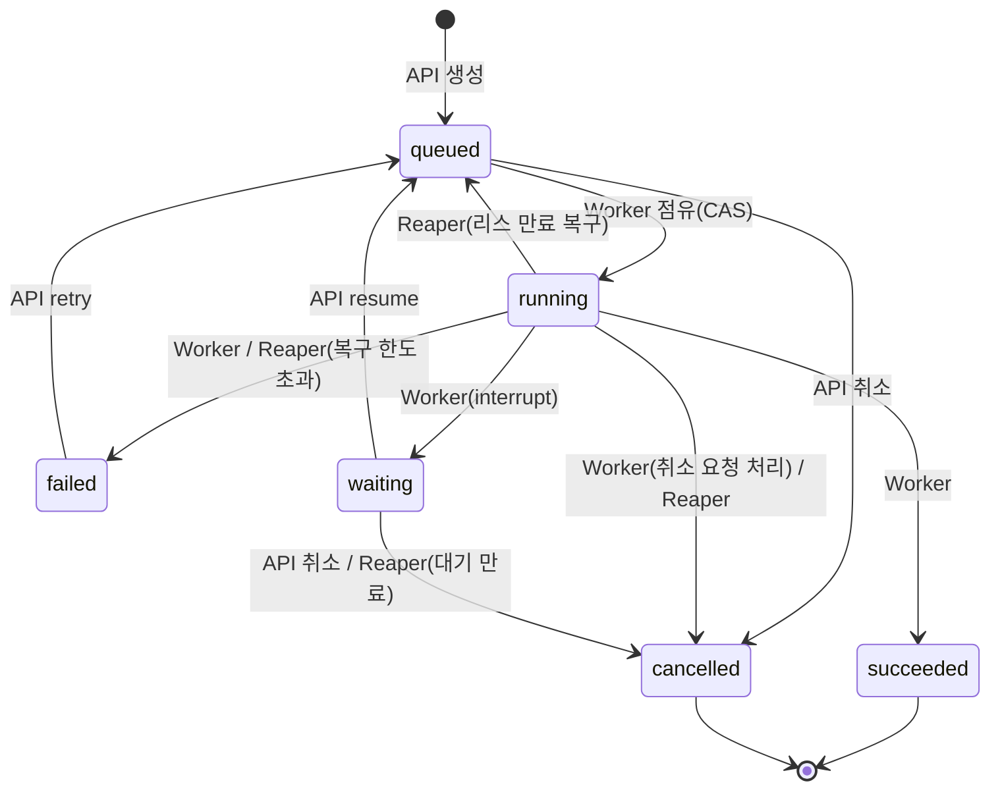

# 에이전틱 워크플로우 빌더 — MVP(코어 + 에디터) 설계

- 작성일: 2026-09-11 (v2: 실행 의미론·이벤트·API 계약·보안 정책 보강)
- 상태: 설계 승인됨, v2 리뷰 대기
- 범위: 하위 프로젝트 1(워크플로우 코어) + 2(비주얼 에디터)

---

## 1. 배경: 조사 요약

### 1.1 워크플로우 vs 에이전트 (Anthropic, *Building Effective Agents*)

- **워크플로우**: 미리 정의된 코드 경로로 LLM·도구를 오케스트레이션. 예측 가능·디버깅 쉬움.
- **에이전트**: LLM이 스스로 프로세스와 도구 사용을 결정. 유연하지만 비용·오류 누적 위험.
- 조합 가능한 5가지 패턴: Prompt Chaining, Routing, Parallelization, Orchestrator-Workers, Evaluator-Optimizer.
- 권고: 단순한 조합에서 시작하고, 도구 설명(ACI)에 UI만큼 투자할 것.

### 1.2 기존 구현체


| 부류        | 예                                 | 특징                                                                  |
| ------------- | ------------------------------------ | ----------------------------------------------------------------------- |
| 코드 우선   | LangGraph                          | StateGraph + 조건부 엣지 + checkpointer, interrupt 기반 HITL          |
| 비주얼 빌더 | Dify, Langflow, Flowise, n8n, Coze | 드래그앤드롭 캔버스, Dify는 ReactFlow 유사 그래프를 YAML DSL로 export |
| 내구 실행   | Temporal, Inngest                  | 스텝 단위 체크포인트·재생, 장기 대기(HITL)                           |

공통 레이어: 에디터 UI → 워크플로우 정의(DSL) → 검증기 → 실행 엔진 → 내구성/HITL → 관측성.

### 1.3 출처

- [Building Effective AI Agents — Anthropic](https://www.anthropic.com/research/building-effective-agents)
- [Open Source AI Agent Platform Comparison (2026) — Jimmy Song](https://jimmysong.io/blog/open-source-ai-agent-workflow-comparison/)
- [LangGraph vs n8n — ZenML](https://www.zenml.io/blog/langgraph-vs-n8n)
- [Langflow vs Flowise vs n8n — Blck Alpaca](https://blckalpaca.at/en/knowledge-base/ai-agents/ai-agent-frameworks-comparison/langflow-vs-flowise-vs-n8n)
- [Workflow Editor template — React Flow](https://reactflow.dev/ui/templates/workflow-editor)
- [LangGraph Interrupts — LangChain Docs](https://docs.langchain.com/oss/python/langgraph/interrupts)
- [LangGraph Persistence: Checkpointers — AI/TLDR](https://ai-tldr.dev/learn/agent-frameworks/langchain-ecosystem/langgraph-persistence-checkpointers/)
- [Dify Workflow DSL skill (DSL 구조 참고)](https://github.com/yzmw123/dify-workflow-dsl-skill)
- [Durable Execution for AI Agents — Inngest](https://www.inngest.com/blog/durable-execution-key-to-harnessing-ai-agents)
- [Durable Execution meets AI — Temporal](https://temporal.io/blog/durable-execution-meets-ai-why-temporal-is-the-perfect-foundation-for-ai)

---

## 2. 제품 결정 사항


| 항목            | 결정                                                                    |
| ----------------- | ------------------------------------------------------------------------- |
| 대상            | 비개발자용 SaaS                                                         |
| 워크플로우 유형 | 범용 (자동화·챗봇·콘텐츠 생성 모두) → 노드 플러그인 구조가 핵심      |
| 실행 엔진       | TS 프론트엔드 + Python(FastAPI + LangGraph)                             |
| LLM             | 온프레미스 Ollama, 소형 모델(~14B)                                      |
| 인프라          | 컨테이너 자체 운영 (Docker Compose)                                     |
| AI 코파일럿     | MVP 제외. 단, DSL은 LLM이 생성·검증하기 쉬운 JSON Schema 기반으로 설계 |

### 2.1 전체 로드맵(하위 프로젝트)


| #     | 하위 프로젝트                                                       | 의존    |
| ------- | --------------------------------------------------------------------- | --------- |
| **1** | **워크플로우 코어** — DSL, 검증기, 실행 엔진, 노드 라이브러리      | —      |
| **2** | **비주얼 에디터** — 캔버스, 노드 설정 패널, 테스트 실행, 실행 추적 | 1       |
| 3     | 런타임 확장 — 스케줄/웹훅 트리거, 수평 확장, 고급 재시도           | 1       |
| 4     | 플랫폼 — 인증, 워크스페이스(멀티테넌시), 권한, 시크릿 관리 고도화  | —      |
| 5     | 배포·연동 — API/웹훅/채팅 위젯 공개, 커넥터, RAG 지식베이스       | 1, 3, 4 |
| 6     | 과금·사용량                                                        | 4       |

이 문서는 1 + 2만 다룬다. 단, `http_request` 노드의 인증 헤더를 평문 DSL에 두지 않기 위해 **최소 시크릿 저장소(10.2)** 는 MVP에 포함한다.

### 2.2 MVP 비목표 (명시적 제외)

- 도구 호출 기반 에이전트 노드, Orchestrator-Workers(동적 Send) — 소형 모델의 도구 호출 불안정성 때문
- RAG 지식베이스, 코드 실행 노드(샌드박스 보안), 웹훅/스케줄 트리거
- 인증·멀티테넌시(단일 기본 워크스페이스로 동작, 단 스키마에 `workspace_id` 선반영)
- 자동 PII 탐지·마스킹(대신 워크플로우 단위 "실행 데이터 저장 안 함" 옵션 제공)
- 실시간 공동 편집(대신 낙관적 잠금으로 덮어쓰기만 방지)
- AI 코파일럿, 과금

### 2.3 성공 기준

1. 비개발자가 에디터에서 Chaining, Routing, Parallelization, Evaluator-Optimizer 패턴 워크플로우를 드래그앤드롭으로 만들고 실행할 수 있다.
2. 실행 중 노드 진행 상황이 캔버스에 실시간으로 표시되고, SSE 연결이 끊겼다 복구되어도 누락 없이 이어서 표시된다.
3. Human Approval 노드에서 대기 중인 실행은 워커 재시작 후에도 승인 시 이어서 실행된다.
4. 실패한 실행을 재시도하면 체크포인트에 결과가 기록된 노드는 다시 실행되지 않는다.
5. 새 노드 타입 추가 시 백엔드에 노드 스펙 하나를 추가하는 것만으로 에디터 팔레트·설정 폼에 나타난다.
6. 같은 실행을 두 워커가 동시에 진행하지 않으며, 워커가 죽은 실행은 자동으로 복구된다.

---

## 3. 아키텍처

```
[web]    Next.js(App Router) + @xyflow/react + Zustand + ELKjs + RJSF(shadcn 테마)
            │  REST + SSE   (TS 타입은 FastAPI OpenAPI → openapi-typescript로 생성)
[api]    FastAPI
            │  Redis 큐(arq)
[worker] Python — 검증기 → 컴파일러 → LangGraph 실행 → 이벤트 기록·발행
         + reaper(arq cron) — 리스 만료 실행 복구, 대기 만료, 보존 기간 정리
            │
[Postgres]  애플리케이션 테이블 + 이벤트 로그 + LangGraph 체크포인트 (source of truth)
[Redis]     작업 큐 · 실시간 이벤트 전송(pub/sub) · 실행 제어 채널 · 모델별 세마포어
[Ollama]    모델 서버 (LLM 게이트웨이를 통해서만 호출)
```

**원칙: Postgres가 유일한 진실의 원천이고, Redis는 전송·조정 수단이다.** Redis 데이터가 모두 사라져도 실행 상태·이벤트·체크포인트는 복원 가능해야 한다(큐는 reaper가 재등록).

### 3.1 저장소 구조

```
apps/web/                      # Next.js 에디터
services/engine/               # Python 패키지 (api와 worker가 공유)
  engine/api/                  # FastAPI 라우터
  engine/worker/               # arq 워커 엔트리포인트, 리스·하트비트, reaper
  engine/dsl/                  # DSL Pydantic 모델, 타입 시스템
  engine/validator/            # 그래프·변수·타입 검증
  engine/compiler/             # DSL → StateGraph, 노드 래퍼
  engine/nodes/                # 노드 스펙 (노드 타입당 1 모듈) + 레지스트리
  engine/templates/            # Jinja2 샌드박스 렌더러, 참조 파서
  engine/llm/                  # LLM 게이트웨이 (Ollama, OpenAI 호환)
  engine/events/               # 이벤트 기록(Postgres) + 발행(Redis)
  engine/security/             # 시크릿 암호화, 레닥션, HTTP egress 정책
  engine/db/                   # SQLAlchemy 모델, Alembic 마이그레이션
deploy/docker-compose.yml      # web, api, worker, postgres, redis, ollama
```

### 3.2 컴포넌트 책임


| 컴포넌트    | 책임                                                                | 의존                             |
| ------------- | --------------------------------------------------------------------- | ---------------------------------- |
| `dsl`       | DSL 구조 정의(Pydantic), JSON Schema export, 타입 표현              | —                               |
| `templates` | 템플릿 파싱(참조 추출), 샌드박스 렌더링, 값 참조/문자열 보간 구분   | `dsl`                            |
| `nodes`     | 노드 타입별 Config/Output 모델, 기본 정책, 핸들,`execute()`         | `llm`, `security`                |
| `validator` | DSL → 오류·경고 목록 (부작용 없음)                                | `dsl`, `nodes`, `templates`      |
| `compiler`  | 검증된 DSL → 컴파일된 LangGraph, 노드 래퍼(재시도·타임아웃·기록) | `dsl`, `nodes`, `events`         |
| `llm`       | 모델 호출, 구조화 출력, 동시성 제한, 취소                           | Redis, Ollama                    |
| `events`    | 이벤트에 run 단위 순번 부여·저장·발행, SSE 재생                   | Postgres, Redis                  |
| `worker`    | 실행 점유(리스), 그래프 실행, 취소 처리, reaper                     | 위 전부                          |
| `api`       | CRUD, 버전 생성, 검증, 실행/재개/재시도/취소, SSE, 시크릿           | `validator`, `events`, DB, Redis |
| `web`       | 캔버스 편집, 설정·정책 폼 자동 생성, 실행 추적 UI                  | `api`                            |

### 3.3 데이터 모델 (Postgres)


| 테이블              | 주요 컬럼                                                                                                                                                                                                                                                                                                                                                                                                                        |
| --------------------- | ---------------------------------------------------------------------------------------------------------------------------------------------------------------------------------------------------------------------------------------------------------------------------------------------------------------------------------------------------------------------------------------------------------------------------------- |
| `workflows`         | `id`, `workspace_id`, `name`, `draft_dsl jsonb`, `revision int`, `created_at`, `updated_at`                                                                                                                                                                                                                                                                                                                                      |
| `workflow_versions` | `id`, `workflow_id`, `workspace_id`, `version_no`, `dsl jsonb`, `dsl_hash`, `created_at` — **불변**, `unique(workflow_id, dsl_hash)`, `unique(workflow_id, version_no)`                                                                                                                                                                                                                                                         |
| `runs`              | `id`, `workspace_id`, `workflow_id`, `workflow_version_id`, `status`, `inputs jsonb`, `outputs jsonb`, `error jsonb`, `idempotency_key`, `lease_owner`, `lease_expires_at`, `cancel_requested_at`, `waiting_node_id`, `waiting_exec_index`, `resume_payload jsonb`, `retry_count`, `recovery_count`, `event_seq bigint`, `created_at`, `started_at`, `finished_at`, `active_ms bigint` — `unique(workflow_id, idempotency_key)` |
| `node_runs`         | `id`, `run_id`, `node_id`, `exec_index`, `attempt`, `status`, `input jsonb`, `output jsonb`, `error jsonb`, `tokens_in`, `tokens_out`, `truncated bool`, `started_at`, `finished_at` — `unique(run_id, node_id, exec_index, attempt)`                                                                                                                                                                                           |
| `run_events`        | `run_id`, `seq bigint`, `type`, `node_id`, `exec_index`, `attempt`, `payload jsonb`, `created_at` — `primary key(run_id, seq)`                                                                                                                                                                                                                                                                                                  |
| `secrets`           | `id`, `workspace_id`, `name`, `ciphertext bytea`, `created_at`, `updated_at` — `unique(workspace_id, name)`                                                                                                                                                                                                                                                                                                                     |
| (LangGraph)         | 체크포인트 테이블 —`AsyncPostgresSaver.setup()`이 관리, 암호화 직렬화(10.3)                                                                                                                                                                                                                                                                                                                                                     |

- `node_runs.status`: `running | succeeded | defaulted | failed | waiting | cancelled`
- MVP는 단일 기본 워크스페이스(`workspace_id` 고정값)로 동작한다.

---

## 4. 워크플로우 DSL

### 4.1 구조

```json
{
  "version": "1",
  "settings": { "storeRunData": true },
  "nodes": [
    { "id": "start", "type": "start", "label": "시작", "position": {"x": 0, "y": 0},
      "config": { "inputs": { "type": "object",
                  "properties": { "topic": {"type": "string"} }, "required": ["topic"] } } },
    { "id": "llm_1", "type": "llm", "label": "초안 작성", "position": {"x": 300, "y": 0},
      "config": { "model": "qwen2.5:14b", "prompt": "{{start.topic}}에 대한 글을 써줘", "temperature": 0.7 },
      "policy": { "timeoutSec": 120, "retry": { "maxAttempts": 3, "backoff": "exponential", "initialDelaySec": 2 },
                  "onError": "fail" } },
    { "id": "end", "type": "end", "label": "끝", "position": {"x": 600, "y": 0},
      "config": { "outputs": { "result": "{{llm_1.text}}" } } }
  ],
  "edges": [
    { "id": "e1", "source": "start", "sourceHandle": "out", "target": "llm_1" },
    { "id": "e2", "source": "llm_1", "sourceHandle": "out", "target": "end" }
  ]
}
```

- `settings.storeRunData`(기본 `true`): `false`면 노드 입출력을 저장하지 않는다(10.1).
- `edges` 배열의 순서는 **선언 순서**로서 의미가 있다(병렬 합류 결과의 순서, 5.7).
- 엣지의 `maxIterations`는 back-edge에만 지정한다(4.8).

### 4.2 노드 ID와 표시 이름

- `id`: **생성 시 한 번 정해지고 바뀌지 않는다.** 형식 `<type>_<n>`(예: `llm_1`), `^[a-z][a-z0-9_]{0,39}$`, 워크플로우 내 유일. `start`, `end`는 고정 ID.
- `label`: 사용자가 자유롭게 바꾸는 표시 이름. 유일할 필요 없음. 실행에 영향 없음.
- 템플릿 참조는 항상 `id`로 저장되고, 에디터는 이를 `label` 칩으로 표시한다. 이름을 바꿔도 참조를 고칠 필요가 없다.
- `dsl_hash`는 `position`과 `label`을 제외한 정규화 JSON(키 정렬)의 SHA-256.

### 4.3 실행 정책(`policy`) — 설정(`config`)과 분리


| 필드                    | 타입·범위                         | 의미                                              |
| ------------------------- | ------------------------------------ | --------------------------------------------------- |
| `timeoutSec`            | 1–600 (`http_request`는 최대 120) | 시도 1회의 제한 시간                              |
| `retry.maxAttempts`     | 1–5                               | **첫 시도를 포함한 총 시도 횟수**                 |
| `retry.backoff`         | `fixed` \| `exponential`           | 재시도 간격 방식 (지수는 ×2, 최대 60초)          |
| `retry.initialDelaySec` | 0.5–30                            | 첫 재시도 전 대기                                 |
| `onError`               | `fail` \| `default`                | 모든 시도 실패 시 동작                            |
| `defaultOutput`         | 노드 Output 스키마에 맞는 값       | `onError=default`일 때 필수, 검증기가 스키마 검사 |

- 정책을 생략하면 노드 타입의 기본 정책(4.7)을 쓴다. 정책을 지원하지 않는 노드에 `policy`가 있으면 검증 오류.
- **재시도 대상 오류**: 타임아웃, 연결 오류, HTTP 408/429/5xx, `LLM_UNAVAILABLE`, `STRUCTURED_OUTPUT_FAILED`.
- **재시도하지 않는 오류**: `TYPE_MISMATCH`, 템플릿 렌더링 오류, HTTP 그 외 4xx, `HTTP_BLOCKED`, `OUTPUT_TOO_LARGE`.
- 에디터는 노드 패널에서 **설정** 탭과 **실행 정책** 탭을 분리한다.

### 4.4 템플릿과 변수 참조

- 참조 문법: `{{<node_id>.<field>[.<field>...]}}`, 시작 입력은 `{{start.<field>}}`, 시크릿은 `{{secret.<NAME>}}`(10.2).
- 렌더러: Jinja2 `SandboxedEnvironment` + `StrictUndefined`. 허용 구문: ``, ``, 필터 `default, tojson, length, upper, lower, trim, join, round`. 그 외 필터·속성 접근·호출은 검증 오류.
- **값 참조 vs 문자열 보간**
  - 필드 값 전체가 `{{ 표현식 }}` 하나뿐이면 **값 참조**: 원래 타입(객체, 숫자 등)이 그대로 전달된다.
  - 그 외 모든 경우는 **문자열 보간**: 결과는 항상 `string`. 객체·배열이 보간되면 JSON 문자열로 직렬화된다(검증 경고).
- **실행 보장 규칙**: 참조한 노드가 참조하는 노드보다 **반드시 먼저 실행된다고 보장**되지 않으면 `| default(...)` 필터가 필수다. 없으면 검증 오류.
  - 보장 집합 `before(N)` 정의(back-edge 제외 그래프에서 계산):
    - `before(start) = ∅`
    - 일반 노드: `before(N) = ⋂ { before(P) ∪ {P} | P는 N의 선행 노드 }`
    - `merge` 노드: `before(N) = ⋃ { before(P) ∪ {P} | P는 N의 선행 노드 }` (모든 분기를 기다리므로)
  - 예: 조건 분기 뒤 `end`에서 한쪽 분기 노드를 참조 → `{{llm_2.text | default('')}}` 필요.
  - 예: Evaluator 루프에서 생성기가 이전 평가 피드백 참조 → `{{llm_eval.feedback | default('')}}` (첫 회엔 없음).
- 루프 안에서 여러 번 실행된 노드를 참조하면 **가장 최근 실행 결과**를 얻는다.

### 4.5 타입 시스템

- 타입: `string`, `number`(integer 포함), `boolean`, `object`, `array`, `null`, `unknown`. 모든 타입은 노드 Output의 JSON Schema에서 유도한다. 선택(optional) 필드는 `T | null`.
- 필드 경로 검증: 스키마가 알려진 경우 중첩 필드 존재 여부까지 검사. `unknown` 아래 경로는 검사하지 않는다.
- 설정 필드는 JSON Schema에 기대 타입과 `x-template: true`를 가진다. 기대 타입 `any`는 모든 값 허용.
- **호환성 규칙(값 참조 기준. 문자열 보간은 대상이 항상 `string`)**


| 원천 \ 대상    | string           | number           | boolean          | object           | array            | any |
| ---------------- | ------------------ | ------------------ | ------------------ | ------------------ | ------------------ | ----- |
| string         | ✅               | ❌               | ❌               | ❌               | ❌               | ✅  |
| number         | ✅ 변환          | ✅               | ❌               | ❌               | ❌               | ✅  |
| boolean        | ✅ 변환          | ❌               | ✅               | ❌               | ❌               | ✅  |
| object / array | ⚠️ JSON 직렬화 | ❌               | ❌               | ✅(object만)     | ✅(array만)      | ✅  |
| null /`T|null` | ⚠️             | ⚠️             | ⚠️             | ⚠️             | ⚠️             | ✅  |
| unknown        | ✅               | ⚠️ 런타임 검사 | ⚠️ 런타임 검사 | ⚠️ 런타임 검사 | ⚠️ 런타임 검사 | ✅  |

- ❌ = 검증 **오류**(실행 불가), ⚠️ = **경고**(실행 가능). `| default(x)`가 붙으면 null 가능성은 제거된다.
- 런타임 검사 실패 시 해당 노드는 `TYPE_MISMATCH`로 실패(재시도 없음).
- 같은 Output 스키마를 **변수 자동완성, 검증, 런타임 검사**가 공유한다.

### 4.6 노드 스펙 규약 (단일 원천 = Python)

```python
class NodeSpec(Protocol):
    type: str                      # "llm"
    label: str                     # 팔레트 표시 이름
    category: str                  # "AI" | "Logic" | "Integration" | "Human" | "IO"
    Config: type[BaseModel]        # 설정 폼 → JSON Schema (템플릿 필드는 x-template)
    default_policy: Policy | None  # None이면 정책 미지원
    side_effects: bool             # 외부 부작용 여부 (at-least-once 경고 표시에 사용)
    def output_schema(self, config) -> dict          # 동적 출력 스키마 (llm outputSchema, merge 등)
    def handles(self, config) -> list[str]           # 출력 핸들 (분기 노드는 config에 따라 동적)
    async def execute(self, ctx: NodeContext, config) -> NodeResult  # NodeResult = output (+ 분기 노드는 선택된 handle)
```

- `GET /node-types`가 모든 스펙의 `type/label/category/configSchema/defaultPolicy/sideEffects/handles 규칙`을 반환하고, 에디터는 이것으로 팔레트와 폼(RJSF)을 만든다.
- 노드 추가 = `engine/nodes/<type>.py` 하나 추가 + 레지스트리 등록. 프론트엔드 변경 불필요(커스텀 위젯이 필요한 경우만 예외).

### 4.7 MVP 노드 (9종)


| 타입             | Config 핵심                                        | Output                                         | 핸들                  | 기본 정책                                          |
| ------------------ | ---------------------------------------------------- | ------------------------------------------------ | ----------------------- | ---------------------------------------------------- |
| `start`          | 입력 JSON Schema                                   | 입력 필드들                                    | `out`                 | 없음                                               |
| `end`            | 출력 매핑(템플릿)                                  | 매핑 결과                                      | 없음                  | 없음                                               |
| `llm`            | model, system, prompt, temperature,`outputSchema?` | `{text}` 또는 `outputSchema`                   | `out`                 | 120초, 3회, fail                                   |
| `classifier`     | model, 분류 대상 템플릿, categories[{id, 설명}]    | `{category, reason}`                           | 카테고리별 +`default` | 60초, 3회, fail                                    |
| `condition`      | 조건 목록(좌변, 연산자, 우변) + AND/OR             | `{result: boolean}`                            | `true`, `false`       | 없음                                               |
| `merge`          | 합치기 방식`object` \| `list`                      | `{branches}` (5.7)                             | `out`                 | 없음                                               |
| `template`       | Jinja 템플릿, 출력 형식`text` \| `json`            | `{text}` 또는 `{data: unknown}`                | `out`                 | 없음                                               |
| `http_request`   | method, url, headers, body,`sendIdempotencyKey`    | `{status, headers, body: unknown}`             | `out`                 | 30초, 멱등 메서드 3회 / POST·PATCH 1회(5.4), fail |
| `human_approval` | 안내 메시지, 검토 대상(값 참조 가능),`allowEdit`   | `{decision, comment, editedValue, reviewedAt}` | `approve`, `reject`   | 없음 (대기 한도 11장)                              |

- `condition` 연산자: `== != > >= < <=`(number), `contains not_contains`(string/array), `is_empty is_not_empty`(모든 타입). 피연산자 타입이 연산자와 맞지 않으면 검증 오류. 임의 코드 평가 없음.
- `classifier`의 `onError=default`는 `{category: "default", reason: "error"}`로 `default` 핸들을 탄다.
- `side_effects=true` 노드(`http_request`)는 에디터에서 "재실행될 수 있음" 안내를 표시한다.

### 4.8 그래프 규칙 (검증기가 강제)

1. `start` 정확히 1개, `end` 정확히 1개. 실행 결과(`runs.outputs`)는 `end`의 출력 매핑 결과다.
2. 모든 노드는 `start`에서 도달 가능하고 `end`에 도달 가능해야 한다.
3. 분기 노드(`condition`, `classifier`, `human_approval`)의 **모든 핸들**에는 엣지가 1개 이상 있어야 한다.
4. **Back-edge**(사이클을 만드는 엣지)는 `condition` 또는 `classifier`에서만 출발할 수 있고 `maxIterations`(1–20) 필수. 그 외 사이클은 오류.
   - **판정 방법:** `maxIterations`가 있는 엣지가 back-edge다. 에디터는 사이클을 닫는 연결을 그릴 때 이 값을 입력받는다. 나머지(순방향) 엣지만으로는 사이클이 없어야 한다. back-edge는 순방향 경로로 자신의 출발 노드에 되돌아오는 사이클을 닫아야 한다. 엣지 선언 순서와 무관하게 같은 그림은 같은 판정을 받는다.
   - `human_approval`의 "반려 → 다시 생성" 루프는 MVP에서 허용하지 않는다. 반려 후 `condition`을 거쳐 되돌아가게 구성한다.
5. 한 분기 노드에서 back-edge를 가질 수 있는 핸들은 1개뿐이며, `condition`의 반대 핸들과 `classifier`의 `default` 핸들은 back-edge일 수 없다(한도 소진 시 탈출 경로).
6. 하나의 출력 핸들에서 여러 엣지가 나가면 병렬 실행(fan-out)이다. fan-out당 분기 최대 10개.
7. 같은 fan-out에서 갈라진 둘 이상의 분기가 `merge`가 아닌 노드(`end` 포함)로 합류하면 오류 — 그 노드가 분기 수만큼 중복 실행되기 때문. 조건 분기처럼 한 번에 한 경로만 활성화되는 합류는 허용.
8. `merge`로 들어오는 모든 경로는 같은 fan-out 지점에서 무조건 엣지로 갈라진 것이어야 한다(경로 중간에 분기 노드가 있으면 오류) — 비활성 분기를 영원히 기다리는 교착 방지.
   - **MVP 구현 규칙(규칙 7·8을 구조적으로 보장):** 병렬 영역 = 한 출력 핸들의 fan-out이며, 각 분기는 **1개 이상의 일반 노드로 된 선형 체인**(분기 노드 아님, 순방향 입력 1개·출력 1개)이고, 모든 분기가 **같은 `merge` 하나**로 모이며 그 `merge`에는 이 분기들만 들어온다. 중첩 병렬 영역은 MVP 범위 밖이다.
9. 루프 본문(back-edge가 만드는 사이클) 안에는 fan-out/`merge`를 둘 수 없다(MVP 제약). back-edge가 `merge`로 되돌아가는 경우도 포함한다.
10. 검증 결과는 `error`(실행 차단)와 `warning`(표시만)으로 구분한다. draft 저장은 오류가 있어도 허용한다.

---

## 5. 실행 의미론

### 5.1 실행 상태 머신




| 전이                                                             | 주체         | 조건                                                          |
| ------------------------------------------------------------------ | -------------- | --------------------------------------------------------------- |
| (생성) →`queued`                                                | API          | 검증 통과, 버전 확정                                          |
| `queued` → `running`                                            | Worker       | `UPDATE … WHERE status='queued'` CAS 성공 시에만             |
| `queued` → `cancelled`                                          | API          | 즉시                                                          |
| `running` → `succeeded` \| `failed` \| `waiting` \| `cancelled` | Worker       | 리스 보유자만 (`WHERE lease_owner=:me`)                       |
| `running` → `queued`                                            | Reaper       | 리스 만료, 취소 요청 없음,`recovery_count < 3`                |
| `running` → `failed`                                            | Reaper       | 리스 만료,`recovery_count ≥ 3` (`ENGINE_RECOVERY_EXHAUSTED`) |
| `running` → `cancelled`                                         | Reaper       | 리스 만료 + 취소 요청 있음                                    |
| `waiting` → `queued`                                            | API          | resume 요청 검증 통과                                         |
| `waiting` → `cancelled`                                         | API / Reaper | 취소 요청 / 대기 30일 초과                                    |
| `failed` → `queued`                                             | API          | retry 요청, 보존 기간 내(체크포인트 존재)                     |

- **종료 상태**: `succeeded`, `cancelled`(재시도 불가). `failed`는 retry로만 다시 `queued`가 된다.
- **API는 절대 `running`으로 전이시키지 않는다.** 실행 시작은 오직 워커가 CAS로 점유할 때다.
- 허용되지 않은 전이 요청은 `409 INVALID_STATE_TRANSITION`.
- `running` 중 취소는 상태를 바로 바꾸지 않고 `cancel_requested_at`만 기록한다(5.9). UI는 이를 "취소 중"으로 표시한다.
- 모든 전이는 같은 트랜잭션에서 이벤트(`run_*`)를 기록한다(7장).

### 5.2 중복 실행 방지: 리스·펜싱·Reaper

- **점유**: 워커는 `UPDATE runs SET status='running', lease_owner=:w, lease_expires_at=now()+30s WHERE id=:id AND status='queued' RETURNING *`. 실패하면 작업을 버린다(중복 큐 등록에도 안전).
- **하트비트**: 10초마다 `lease_expires_at` 연장 + `cancel_requested_at` 확인. 연장에 실패(리스 상실)하면 즉시 자신의 실행 태스크를 취소한다.
- **펜싱**: 워커의 모든 `runs` 갱신은 `WHERE lease_owner=:w` 조건을 붙인다. 노드 래퍼는 각 노드 시작 전 로컬 리스 유효 플래그를 확인한다.
- **Reaper**(15초 주기, arq cron):
  - 리스 만료된 `running` → 5.1 규칙대로 `queued`(재등록, `recovery_count+1`) / `failed` / `cancelled`.
  - 60초 넘게 `queued`인 실행 → 큐 재등록(큐 유실 대비, CAS가 중복을 막음).
  - `waiting` 30일 초과 → `cancelled`.
  - 보존 기간 정리(10.4).
- 남는 위험: 리스를 잃은 워커가 알아차리기 전(최대 하트비트 간격) 노드 하나를 더 실행할 수 있다 → 5.4의 at-least-once로 수용한다.

### 5.3 노드 실행 의미론

- **실행 상태**
  ```python
  class RunState(TypedDict):
      inputs: dict
      outputs: Annotated[dict[str, Any], merge_dicts]        # node_id → 최신 출력
      routes: Annotated[dict[str, list[str]], merge_dicts]   # 분기 node_id → 선택된 다음 노드들
      loop_counters: Annotated[dict[str, int], merge_dicts]  # back-edge id → 누적 통과 횟수
      exec_counts: Annotated[dict[str, int], merge_dicts]    # node_id → 성공(또는 defaulted) 실행 횟수
  ```
- **exec_index**: 노드가 몇 번째 실행인지. `exec_counts[node_id] + 1`로 계산하며, 노드가 성공해 상태에 기록될 때만 증가한다. 따라서 **재시도·크래시 복구·수동 retry 동안 exec_index는 변하지 않고**, 루프로 다시 실행될 때만 증가한다.
- **attempt**: 같은 `(run, node, exec_index)`에 대한 시도 번호. `node_runs`의 기존 행 수 + 1. 정책 재시도, 크래시 복구, 수동 retry 모두 attempt를 증가시킨다.
- **노드 성공의 기준 = 노드의 상태 쓰기가 체크포인트에 영속화된 것.** 그래프는 `durability="sync"`로 실행해 다음 단계로 넘어가기 전에 체크포인트를 저장한다. 같은 슈퍼스텝의 병렬 노드 중 일부가 실패해도, 완료된 노드의 쓰기는 LangGraph의 pending writes로 보존되어 재개 시 재실행되지 않는다.
- `node_runs`는 **관측 기록**이고 진실의 원천은 체크포인트다. `node_runs`에 `succeeded`로 기록됐지만 체크포인트 저장 전에 워커가 죽은 경우, 재개 시 같은 exec_index로 attempt가 하나 늘어난 행이 새로 생긴다.
- **노드 래퍼 동작(모든 노드 공통)**
  1. 리스·취소 플래그 확인 → 취소면 중단.
  2. exec_index 계산, 템플릿 렌더링(값 참조 타입 런타임 검사 포함).
  3. 시도 루프(최대 `maxAttempts`): `node_runs(running)` 기록 + `node_started` 이벤트 → `asyncio.timeout(timeoutSec)` 안에서 `execute()` → 성공 시 `node_runs(succeeded)` + `node_finished` 이벤트 후 상태 쓰기 반환. 실패 시 `node_runs(failed)` + `node_failed{willRetry}` 이벤트, 재시도 대상 오류면 백오프 후 다음 시도.
  4. 모든 시도 실패: `onError=default`면 `defaultOutput`을 출력으로 `node_runs(defaulted)` 후 계속, `fail`이면 `NodeFailedError` → 실행 `failed`.
  5. 분기 노드는 선택된 핸들과 루프 카운터 증가분을 **자신의 상태 쓰기에 포함**한다(`routes`, `loop_counters`). 조건부 엣지 함수는 `state["routes"][node_id]`를 읽기만 한다 → 재개해도 같은 경로.
- 재시도는 LangGraph `RetryPolicy`가 아니라 **이 래퍼가 소유**한다(`onError=default`와 attempt 기록을 한 곳에서 처리하기 위해).

### 5.4 At-least-once와 멱등성

- **실행 보장 수준은 at-least-once다.** 워커 장애 시 노드는 두 번 이상 실행될 수 있다. 체크포인트는 "성공이 기록된 노드를 다시 실행하지 않음"만 보장하며, 외부 부작용의 exactly-once는 보장하지 않는다.
- LLM·template·condition 등 부작용 없는 노드는 재실행해도 무해하다(결과가 달라질 수 있을 뿐).
- `http_request`:
  - `sendIdempotencyKey: true`면 `Idempotency-Key: {run_id}:{node_id}:{exec_index}` 헤더를 보낸다. **attempt는 키에 넣지 않는다** — 재시도·복구 간 키가 같아야 수신 측이 중복을 걸러낼 수 있다. 루프로 재실행되면 exec_index가 달라져 새 키가 된다.
  - 기본 `maxAttempts`: GET/HEAD/PUT/DELETE/OPTIONS는 3, POST/PATCH는 1. POST/PATCH는 `sendIdempotencyKey: true`일 때만 기본 3으로 올라가며, 사용자가 명시적으로 올릴 수도 있다(에디터 경고 표시).
  - 크래시 복구에 의한 재실행은 정책과 무관하게 일어날 수 있음을 에디터 도움말에 명시한다.

### 5.5 재시도(수동 `/retry`)

- `failed` 실행만 가능. `failed → queued`, `retry_count+1`, 같은 `thread_id`(= run_id)로 마지막 체크포인트에서 이어서 실행(`graph.astream(None, config)`).
- 체크포인트에 결과가 기록된 노드는 재실행하지 않는다. 실패한 노드(와 같은 슈퍼스텝에서 완료되지 않은 노드)부터 실행된다. 실패 노드의 정책 시도 횟수는 새로 시작한다.
- 실행 버전은 바뀌지 않는다(원래 `workflow_version_id`). 워크플로우를 고친 뒤 새로 돌리려면 새 실행을 만든다.
- 보존 기간이 지나 체크포인트가 삭제된 실행은 `409 RUN_DATA_EXPIRED`.

### 5.6 Human-in-the-loop

- `human_approval` 래퍼: 검토 값 렌더링 → `node_runs(waiting)` + `node_waiting` 이벤트 → `interrupt({message, review, allowEdit})`. 워커는 `runs.status=waiting`, `waiting_node_id`, `waiting_exec_index`를 기록하고 리스를 해제한다.
- **주의: LangGraph는 재개 시 interrupt한 노드를 처음부터 다시 실행한다.** 따라서 interrupt를 호출하는 노드는 interrupt 이전에 부작용이 없어야 한다(규약). 래퍼는 재진입 시 같은 `(node, exec_index)`의 `waiting` 행을 찾아 새 attempt를 만들지 않고 그 행을 완료 처리한다.
- `POST /runs/{id}/resume {nodeId, execIndex, decision, comment?, editedValue?}`
  - `status=waiting`이고 `nodeId/execIndex`가 대기 중인 것과 일치해야 함(아니면 `409 RESUME_TARGET_MISMATCH`). `editedValue`는 `allowEdit=true`일 때만, 검토 값의 타입과 일치해야 함.
  - `resume_payload` 저장 → `waiting → queued` → 워커가 점유 후 `graph.astream(Command(resume=payload), config)`, 처리 후 `resume_payload` 비움.
- 출력: `{decision, comment, editedValue(수정 없으면 원래 검토 값), reviewedAt}`. `decision`에 따라 `approve`/`reject` 핸들로 진행.
- 대기 중에는 리스·워커 자원을 쓰지 않는다. 대기 시간은 `active_ms`에 포함하지 않는다.

### 5.7 병렬 실행과 Merge

- fan-out된 분기는 LangGraph 슈퍼스텝 단위로 병렬 실행되며, 각 분기 노드는 `outputs[node_id]`에 독립적으로 쓴다(키 충돌 없음).
- `merge`는 `add_edge([src1, src2, ...], merge_id)`로 컴파일되어 **모든 선행 노드가 완료된 뒤 한 번** 실행된다. 분기 길이가 달라도 된다.
- **출력 구조** — 선행 노드 = `merge`로 들어오는 엣지의 source 노드. 순서 = `edges` 배열에서 해당 엣지들의 **선언 순서**(실행 완료 순서와 무관, 결정적).
  - `mode: "object"` → `{"branches": {"<src_id>": <src 출력>, ...}}` (키 순서 = 선언 순서)
  - `mode: "list"` → `{"branches": [<src 출력>, ...]}`
  - 참조 예: `{{merge_1.branches.llm_2.text}}`, `{{merge_1.branches | tojson}}`
- `onError=default`로 기본값을 낸 분기는 그 기본값이 들어간다. `onError=fail`인 분기가 실패하면 실행 전체가 `failed`가 되고, 같은 슈퍼스텝에서 이미 완료된 형제 노드의 결과는 보존된다(5.3). 완료되지 못한 형제 노드는 retry 시 다시 실행된다.

### 5.8 루프

- **`maxIterations` = 해당 back-edge를 통과할 수 있는 최대 횟수**(실행 전체 누적). 예: `maxIterations=3`이면 루프 본문은 최초 1회 + 되돌아가서 최대 3회 = 최대 4회 실행된다.
- 카운터는 back-edge별로 실행 전체에서 누적되며 **초기화되지 않는다**(바깥 루프가 돌아도 안쪽 카운터는 리셋되지 않음). 그래서 총 실행량의 상한이 정해진다.
- 분기 노드가 back-edge 핸들을 선택했는데 카운터가 한도에 도달했으면, `condition`은 반대 핸들, `classifier`는 `default` 핸들로 진행한다(오류 아님). `loop_exhausted` 정보를 `node_finished` 이벤트에 포함한다.
- 루프 본문 노드의 `outputs`는 매 실행마다 최신 값으로 덮어써지고, `node_runs`에는 exec_index별로 모두 남는다.
- `recursion_limit` = `(노드 수) × (1 + Σ 모든 maxIterations) + 10`. 슈퍼스텝 수 ≤ 노드 실행 수 ≤ 이 값이므로 **보수적 상한**(안전장치)이다. 이 한도에 걸리는 것은 엔진 버그로 간주하고 `ENGINE_RECURSION_LIMIT`로 실패시킨다.

### 5.9 취소


| 취소 시점의 상태 | 동작                                                                                                              |
| ------------------ | ------------------------------------------------------------------------------------------------------------------- |
| `queued`         | API가 즉시`cancelled`. 큐에 남은 작업은 워커 CAS 실패로 버려짐                                                    |
| `waiting`        | API가 즉시`cancelled`. 체크포인트는 보존 기간까지 남지만 resume/retry 불가                                        |
| `running`        | API가`cancel_requested_at` 기록 + Redis `run:{id}:control`에 `cancel` 발행 → 워커가 실행 태스크를 `asyncio` 취소 |

- 워커 쪽 취소 경로는 두 가지다: 제어 채널 수신(즉시) + 하트비트의 DB 확인(최대 10초 지연, Redis 유실 대비). 래퍼는 각 노드 시작 전에도 확인한다.
- 진행 중 LLM 호출: HTTP 연결을 끊어 생성 중단을 시도하고, 중단되지 않더라도 결과는 버린다. 모델 세마포어는 반드시 반환한다.
- 진행 중 HTTP 호출: 요청 태스크를 취소한다. 이미 전송된 요청의 외부 효과는 되돌릴 수 없다.
- 취소 완료 시 `running` 상태 `node_runs` → `cancelled`, 실행 → `cancelled`, `run_cancelled` 이벤트.
- 리스 만료 상태에서 취소 요청이 있으면 Reaper가 `cancelled`로 확정한다.

### 5.10 실행 의미론 10문 10답


| 질문                                 | 답                                                                                                                                             |
| -------------------------------------- | ------------------------------------------------------------------------------------------------------------------------------------------------ |
| 1. 같은 노드가 몇 번 실행될 수 있나? | exec_index당 정책 시도(최대 5) + 크래시 복구·수동 retry로 추가 시도 가능(at-least-once). exec_index는 루프에서만 증가(back-edge 한도로 상한). |
| 2. 워커가 죽으면 어디부터 재개하나?  | 리스 만료 → Reaper가`queued`로 되돌리고, 새 워커가 마지막 체크포인트부터 이어간다(5.2, 5.3).                                                  |
| 3. 무엇을 노드 성공으로 보나?        | 노드의 상태 쓰기가 체크포인트(또는 pending writes)에 영속화된 것.`node_runs`는 관측 기록일 뿐(5.3).                                            |
| 4. retry하면 어느 노드부터?          | 체크포인트에 결과가 없는 노드부터 — 실패 노드와 같은 슈퍼스텝의 미완료 노드(5.5).                                                             |
| 5. 외부 HTTP 중복 실행은?            | 가능하다고 명시.`Idempotency-Key: run:node:exec_index`, POST/PATCH는 기본 자동 재시도 없음(5.4).                                               |
| 6. 병렬 분기 결과의 순서는?          | `edges` 배열의 선언 순서. 완료 순서와 무관(5.7).                                                                                               |
| 7. merge 결과 JSON은?                | `object`: `{branches: {src_id: 출력}}`, `list`: `{branches: [출력…]}`(5.7).                                                                   |
| 8.`maxIterations`는 무엇을 세나?     | back-edge 통과 횟수, 실행 전체 누적, 리셋 없음(5.8).                                                                                           |
| 9. 취소 중인 LLM/HTTP는?             | 태스크 취소 + 연결 종료, 결과 폐기. 이미 나간 HTTP 효과는 되돌리지 않음(5.9).                                                                  |
| 10. SSE 재연결 시 무엇을 받나?       | `Last-Event-ID` 이후의 영속 이벤트 전부(순번 보장). 토큰 스트림은 재전송하지 않음(7장).                                                        |

---

## 6. 실행 엔진 구현

### 6.1 검증기

`validate(dsl) -> list[Issue{severity: error|warning, code, message, nodeId?, edgeId?, field?}]`

- 순서: Pydantic 스키마(노드별 Config·Policy) → 참조 무결성(노드·핸들·엣지) → 그래프 규칙(4.8) → 템플릿 문법·허용 필터 → 실행 보장 규칙(4.4) → 타입 호환성(4.5) → 시크릿 참조 위치·존재(10.2) → 제한(11장).
- 에디터 저장 시(표시만)와 실행 요청 시(오류면 거부) 같은 함수를 사용한다.

### 6.2 컴파일러 (DSL → LangGraph)

- 각 DSL 노드 → `add_node(node_id, wrapper(spec, node))`.
- 단일 출력 핸들 노드 → `add_edge`. 분기 노드 → `add_conditional_edges(node_id, lambda s: s["routes"][node_id])`.
- `merge` → `add_edge([선행 노드들…], merge_id)`. `end` → `END`.
- `recursion_limit`은 5.8 공식. 체크포인터는 `AsyncPostgresSaver`(암호화 직렬화), `durability="sync"`.
- 컴파일 결과는 워커 프로세스 내에서 `dsl_hash` 키로 LRU 캐시.

### 6.3 워커 실행 루프

1. 큐에서 `run_id` 수신 → CAS 점유(5.2). 실패 시 종료.
2. 하트비트·제어 채널 구독 시작, `run_started` 이벤트.
3. 입력 결정: 체크포인트가 없으면 초기 상태, `resume_payload`가 있으면 `Command(resume=…)`, 그 외(복구·retry) `None`.
4. `graph.astream(input, {"configurable": {"thread_id": run_id}, "recursion_limit": …}, stream_mode=["updates","custom"])`.
5. 종료 사유에 따라 `succeeded`(end 출력 저장) / `waiting` / `failed`(오류 코드 저장) / `cancelled` 전이 + 이벤트. 리스 해제.

### 6.4 LLM 게이트웨이 (소형 모델 대응)

- 인터페이스: `chat(model, messages, *, schema=None, temperature, stream=False) -> {text | data, tokens_in, tokens_out}`. 구현은 Ollama(네이티브 `format`에 JSON Schema 전달).
- `schema`가 있으면 Pydantic으로 검증, 실패 시 오류 내용을 덧붙여 **한 시도 안에서** 최대 2회 재요청. 그래도 실패하면 `STRUCTURED_OUTPUT_FAILED`(정책상 재시도 대상).
- 모델별 동시 호출 수를 Redis 세마포어로 제한(기본값 = `OLLAMA_NUM_PARALLEL`). 세마포어는 TTL을 두어 워커가 죽어도 자동 반환된다.
- `classifier`는 항상 `schema` 모드(카테고리 ID enum)로 호출.
- 스트리밍 토큰은 `node_token` 일시 이벤트로만 전달(7.1).

---

## 7. 이벤트 프로토콜

### 7.1 이벤트 스키마

```json
{ "seq": 37, "runId": "…", "type": "node_finished", "nodeId": "llm_1",
  "execIndex": 1, "attempt": 1, "ts": "2026-09-11T10:00:00.000Z",
  "payload": { "durationMs": 1830, "tokensOut": 412, "outputPreview": "…" } }
```

- **영속 이벤트**(순번 `seq` 부여, `run_events`에 저장): `run_queued, run_started, run_waiting, run_resumed, run_cancel_requested, run_recovered, run_succeeded, run_failed, run_cancelled, node_started, node_finished, node_failed, node_waiting`.
- **일시 이벤트**(순번 없음, 저장 안 함): `node_token`. 재연결 시 재전송되지 않으며, 최종 결과는 `node_finished`와 `/runs/{id}/nodes`로 얻는다.
- `payload`의 출력 미리보기는 레닥션 후 최대 4KB(10.1). `storeRunData=false`면 미리보기 없음.

### 7.2 순번 부여와 기록

- `seq`는 실행 단위로 1부터 빈틈없이 증가한다. 기록은 한 트랜잭션에서 `UPDATE runs SET event_seq = event_seq + 1 … RETURNING event_seq` → `INSERT run_events`. API와 워커 누구든 같은 방식으로 기록하므로 작성자가 둘이어도 순번이 겹치지 않는다.
- **커밋 후** Redis `run:{id}`에 발행한다. 발행이 실패해도 이벤트는 이미 Postgres에 있다.

### 7.3 SSE와 재연결

`GET /runs/{id}/events` (헤더 `Last-Event-ID` 또는 쿼리 `?after=<seq>`, 없으면 0)

1. **먼저 Redis를 구독**하고 수신 메시지를 버퍼에 쌓는다.
2. Postgres에서 `seq > after` 이벤트를 읽어 전송한다.
3. 버퍼와 이후 실시간 메시지를 전송하되 `seq ≤ 마지막 전송 seq`는 버린다.
4. 수신한 `seq`가 `마지막+1`보다 크면(빈틈) Postgres에서 빈 구간을 읽어 먼저 보낸다.

- 영속 이벤트는 SSE `id: <seq>`를 붙이고, 일시 이벤트는 `id`를 붙이지 않는다(브라우저의 Last-Event-ID가 토큰 때문에 전진하지 않도록).
- 15초마다 `: ping` 주석. 종료 이벤트(`run_succeeded/failed/cancelled`) 전송 후 스트림을 닫는다. `waiting` 중에는 열어둔다.
- 이 순서(구독 → 조회 → 중복 제거 → 빈틈 보충) 덕분에 조회와 구독 사이에 발생한 이벤트도 유실되지 않는다.

---

## 8. API 계약

FastAPI의 OpenAPI 문서가 요청·응답 스키마의 정본이며, 아래는 핵심 계약이다.

### 8.1 엔드포인트


| 메서드     | 경로                       | 요청                                                    | 응답                                                                                                                                                     |
| ------------ | ---------------------------- | --------------------------------------------------------- | ---------------------------------------------------------------------------------------------------------------------------------------------------------- |
| GET        | `/node-types`              | —                                                      | 노드 스펙 목록                                                                                                                                           |
| GET/POST   | `/workflows`               | POST`{name}`                                            | 목록 /`{id, revision: 1}`                                                                                                                                |
| GET        | `/workflows/{id}`          | —                                                      | `{id, name, draftDsl, revision, updatedAt}`                                                                                                              |
| PUT        | `/workflows/{id}`          | `{name?, draftDsl, revision}`                           | `{revision}` (새 값)                                                                                                                                     |
| DELETE     | `/workflows/{id}`          | —                                                      | 204. 활성 실행(queued/running/waiting) 있으면 409                                                                                                        |
| POST       | `/workflows/{id}/validate` | `{draftDsl}`                                            | `{issues: Issue[]}`                                                                                                                                      |
| POST       | `/workflows/{id}/runs`     | 헤더`Idempotency-Key?`, `{inputs, revision}`            | 202`{runId, versionId}`                                                                                                                                  |
| GET        | `/workflows/{id}/runs`     | `?cursor&limit`                                         | 실행 목록(메타데이터)                                                                                                                                    |
| GET        | `/runs/{id}`               | —                                                      | `{id, status, versionId, inputs, outputs, error, cancelRequested, waitingFor?: {nodeId, execIndex, message, review, allowEdit}, retryCount, timestamps}` |
| GET        | `/runs/{id}/nodes`         | —                                                      | `node_runs` 목록                                                                                                                                         |
| GET        | `/runs/{id}/events`        | `Last-Event-ID`                                         | SSE (7.3)                                                                                                                                                |
| POST       | `/runs/{id}/resume`        | `{nodeId, execIndex, decision, comment?, editedValue?}` | 202`{status: "queued"}`                                                                                                                                  |
| POST       | `/runs/{id}/retry`         | —                                                      | 202`{status: "queued"}`                                                                                                                                  |
| POST       | `/runs/{id}/cancel`        | —                                                      | 202`{status}` (`cancelled` 또는 취소 요청됨)                                                                                                             |
| GET        | `/secrets`                 | —                                                      | `[{name, updatedAt}]` (값은 절대 반환 안 함)                                                                                                             |
| PUT/DELETE | `/secrets/{name}`          | PUT`{value}`                                            | 204                                                                                                                                                      |

### 8.2 오류 형식과 코드

```json
{ "error": { "code": "REVISION_CONFLICT", "message": "…", "details": { "currentRevision": 12 } } }
```


| HTTP | code                       | 상황                                                             |
| ------ | ---------------------------- | ------------------------------------------------------------------ |
| 404  | `NOT_FOUND`                | 리소스 없음                                                      |
| 409  | `REVISION_CONFLICT`        | 낙관적 잠금 충돌 (`details.currentRevision`, `details.draftDsl`) |
| 409  | `INVALID_STATE_TRANSITION` | 5.1에서 허용되지 않은 전이                                       |
| 409  | `RESUME_TARGET_MISMATCH`   | 대기 중인 노드/exec_index와 불일치                               |
| 409  | `WORKFLOW_HAS_ACTIVE_RUNS` | 활성 실행이 있는 워크플로우 삭제                                 |
| 409  | `RUN_DATA_EXPIRED`         | 보존 기간 경과로 retry 불가                                      |
| 413  | `PAYLOAD_TOO_LARGE`        | 11장 크기 제한 초과                                              |
| 422  | `VALIDATION_FAILED`        | 검증 오류 (`details.issues`)                                     |
| 422  | `LIMIT_EXCEEDED`           | 11장 개수 제한 초과                                              |

실행 오류(`runs.error.code`, `node_runs.error.code`): `NODE_TIMEOUT, NODE_FAILED, TYPE_MISMATCH, TEMPLATE_ERROR, STRUCTURED_OUTPUT_FAILED, LLM_UNAVAILABLE, HTTP_BLOCKED, HTTP_ERROR, HTTP_RESPONSE_TOO_LARGE, OUTPUT_TOO_LARGE, RUN_TIMEOUT, ENGINE_RECOVERY_EXHAUSTED, ENGINE_RECURSION_LIMIT`.

### 8.3 낙관적 잠금과 버전 생성

- `PUT /workflows/{id}`는 `revision`이 현재 값과 같을 때만 성공하고 `revision+1`을 돌려준다. 다르면 `409 REVISION_CONFLICT` + 현재 draft를 반환한다. 브라우저 탭 두 개 사이의 덮어쓰기도 이것으로 막는다.
- **실행 요청 시 버전 확정**(한 트랜잭션):
  0. `Idempotency-Key`가 있으면 `(workflow_id, key)`로 기존 실행을 먼저 조회해, 있으면 그 실행을 그대로 반환하고 끝낸다(8.4).
  1. `SELECT … FROM workflows WHERE id=:id FOR UPDATE`
  2. 요청의 `revision`이 현재와 다르면 `409 REVISION_CONFLICT` — 사용자가 보고 있는 것과 다른 draft를 실행하지 않도록.
  3. 검증 → 오류면 `422`(버전 생성 안 함).
  4. `dsl_hash` 계산 → 같은 해시의 버전이 있으면 재사용, 없으면 `version_no = max+1`로 생성.
  5. `runs(queued)` 생성 + `run_queued` 이벤트 → 커밋 → 큐 등록(실패해도 Reaper가 재등록).

### 8.4 멱등성(API)

- `POST /workflows/{id}/runs`에 `Idempotency-Key`가 있으면 `(workflow_id, key)`로 기존 실행을 찾아 **같은 응답(202, 기존 runId)** 을 돌려준다. 더블 클릭·네트워크 재시도 방지. 에디터는 실행 버튼마다 UUID 키를 생성한다.
- `resume`, `retry`, `cancel`은 상태 전이 규칙 자체가 멱등성을 보장한다(두 번째 요청은 409 또는 동일 결과).

---

## 9. 에디터 (web)

- **캔버스**: @xyflow/react, 좌측 팔레트(`/node-types`의 category별), 드래그로 노드 추가(ID 자동 생성), 핸들 간 연결, ELKjs "자동 정렬", 되돌리기/다시하기.
- **노드 패널**: `설정` 탭(RJSF, `configSchema`) / `실행 정책` 탭(정책 지원 노드만) / `라벨` 편집. ID는 읽기 전용으로 작게 표시.
- **템플릿 입력**: `{{`를 치면 사용 가능한 변수(보장 집합 + default 필요 표시) 자동완성, 참조는 라벨 칩으로 렌더링, 타입 불일치는 인라인 표시.
- **검증 표시**: 저장 후 `/validate` 결과를 노드·엣지에 오류(빨강)/경고(노랑) 배지로 표시. 오류가 있으면 실행 버튼 비활성.
- **자동 저장**: 변경 후 1초 디바운스, `revision` 포함. `409` 시 "다른 곳에서 변경됨" 대화상자 — 불러오기 / 내 변경으로 덮어쓰기(최신 revision으로 재전송).
- **테스트 실행**: Start 입력 폼 → 실행(Idempotency-Key 포함) → SSE로 노드 상태(대기/실행/재시도/성공/기본값/실패/승인대기/취소) 색상 표시, LLM 토큰 미리보기. 연결이 끊기면 EventSource가 `Last-Event-ID`로 자동 재연결.
- **실행 기록 패널**: 노드 클릭 시 exec_index·attempt별 `node_runs`(입력·출력·오류·소요 시간·토큰). 레닥션된 값은 `[REDACTED]`로 표시.
- **승인 UI**: `waiting` 실행은 승인/반려/수정 입력 대화상자.
- **취소**: 취소 버튼 → `running`이면 "취소 중" 표시 후 `run_cancelled` 이벤트로 확정.
- 상태 관리: Zustand(편집 그래프, 선택, revision, 실행 상태).

---

## 10. 데이터·보안 정책

### 10.1 무엇을 어디에 저장하는가


| 저장소                   | 내용                                                                                                                         | `storeRunData=false`일 때                                           |
| -------------------------- | ------------------------------------------------------------------------------------------------------------------------------ | --------------------------------------------------------------------- |
| 체크포인트               | 실행 상태 전체(모든 노드 출력) — 재개에 필수. 시크릿 값은 포함되지 않음                                                     | 저장하되`succeeded`/`cancelled` 즉시 삭제, `failed`는 보존 기간까지 |
| `node_runs.input/output` | 렌더링된 입력(시크릿 포함 필드는**렌더링 전 템플릿**으로), 출력 — 레닥션 후, 각 최대 256KB(초과 시 잘라서 `truncated=true`) | 저장 안 함(메타데이터만)                                            |
| `run_events.payload`     | 메타데이터 + 레닥션된 출력 미리보기(4KB)                                                                                     | 미리보기 없음                                                       |
| `runs.inputs`            | 실행 입력(레닥션 후) — 워커가 초기 상태를 만들 때 필요                                                                      | 실행이 종료되면 즉시 삭제                                           |
| `runs.outputs`           | 최종 출력(레닥션 후) — 사용자가 받을 결과물                                                                                 | 저장(보존 기간 적용)                                                |
| 서비스 로그              | ID, 타입, 상태, 소요 시간, 크기, 오류 코드만                                                                                 | 동일                                                                |

- **로그에는 프롬프트, 노드 입출력, HTTP 헤더·바디, URL 쿼리 문자열을 절대 남기지 않는다**(URL은 호스트+경로만).
- 실행 데이터에는 개인정보가 들어갈 수 있음을 에디터 설정 화면에 명시하고, 민감한 워크플로우는 `storeRunData=false`를 쓰도록 안내한다.

### 10.2 시크릿

- `secrets` 테이블에 AES-GCM으로 암호화 저장(키: 환경 변수 `ENGINE_SECRET_KEY`). API는 쓰기 전용 — 값은 절대 응답·이벤트·로그에 나오지 않는다.
- 참조 `{{secret.NAME}}`은 **`http_request`의 url/headers/body 필드에서만** 허용(그 외 위치는 검증 오류 — LLM 프롬프트로의 유출 방지). 존재하지 않는 시크릿 참조는 검증 오류.
- 시크릿은 `execute()` 내부에서 요청 직전에 렌더링되며, 렌더링된 값은 상태·체크포인트·`node_runs`에 들어가지 않는다.

### 10.3 레닥션과 암호화

- **헤더 이름 기반**: `Authorization, Proxy-Authorization, Cookie, Set-Cookie, X-API-Key, X-Auth-Token` 값은 저장 시 `[REDACTED]`.
- **키 이름 기반**: 저장되는 JSON에서 키가 `/(authorization|password|passwd|secret|token|api[_-]?key|cookie)/i`에 맞으면 값을 `[REDACTED]`.
- **값 기반**: 해당 실행에서 렌더링된 모든 시크릿 값이 저장 대상 문자열에 나타나면 `[REDACTED]`로 치환(API가 토큰을 되돌려주는 경우 대비).
- 레닥션은 **저장·전송 경로(node_runs, run_events, runs, 로그)** 에 적용된다. 실행 상태(체크포인트)는 다음 노드가 값을 써야 하므로 원값을 유지하되, LangGraph 암호화 직렬화기(AES, 키: `LANGGRAPH_AES_KEY`)로 암호화해 저장한다.
- 자동 PII 탐지는 MVP 비목표(2.2).

### 10.4 보존 기간

- `RUN_DATA_RETENTION_DAYS`(기본 30). 종료된 지 N일 지난 실행: `node_runs.input/output`, `run_events.payload`, `runs.inputs/outputs`, 체크포인트를 삭제하고 메타데이터(상태, 시간, 토큰, 오류 코드)만 남긴다. Reaper가 매일 수행.
- 체크포인트가 삭제된 `failed` 실행은 retry 불가(`RUN_DATA_EXPIRED`).

### 10.5 HTTP Request 노드 egress 정책


| 항목          | 정책                                                                                                                                                                                                                                                                          |
| --------------- | ------------------------------------------------------------------------------------------------------------------------------------------------------------------------------------------------------------------------------------------------------------------------------- |
| 스킴          | `http`, `https`만                                                                                                                                                                                                                                                             |
| 대상          | 배포 설정`HTTP_ALLOWLIST`의 호스트(정확히 일치 또는 `*.suffix`, 선택적 포트)만. 기본값 빈 목록 = 모두 차단                                                                                                                                                                    |
| 사설·특수 IP | 해석된**모든** IP가 루프백(127/8, ::1), 링크로컬(169.254/16 — 클라우드 메타데이터 포함, fe80::/10), 사설(10/8, 172.16/12, 192.168/16, fc00::/7), CGNAT(100.64/10), 0/8, 멀티캐스트에 속하면 차단. 사내 API를 위해 allowlist 항목에 `allowPrivate: true`를 명시한 경우만 허용 |
| DNS rebinding | 이름을 한 번 해석해 검사한 IP로**직접 연결**(IP 고정), Host 헤더·SNI는 원래 이름 사용                                                                                                                                                                                        |
| 리다이렉트    | 최대 3회 수동 추적,**매 홉마다** 스킴·allowlist·IP 검사 재수행. https → http 다운그레이드 금지                                                                                                                                                                             |
| 요청 크기     | 바디 최대 1MB                                                                                                                                                                                                                                                                 |
| 응답 크기     | 최대 5MB, 초과 시 읽기 중단 +`HTTP_RESPONSE_TOO_LARGE`                                                                                                                                                                                                                        |
| 타임아웃      | 정책`timeoutSec`(최대 120) — 연결·전체 모두 적용                                                                                                                                                                                                                            |
| TLS           | 인증서 검증 항상 활성(끄는 옵션 없음)                                                                                                                                                                                                                                         |
| 쿠키          | 쿠키 저장소 사용 안 함                                                                                                                                                                                                                                                        |
| 차단 시       | `HTTP_BLOCKED`(재시도 없음), 오류 메시지에 차단 사유(호스트/IP 범주)만 표시                                                                                                                                                                                                   |

---

## 11. 제한 및 성능 목표

### 11.1 제한 (초과 시 `422 LIMIT_EXCEEDED` / `413 PAYLOAD_TOO_LARGE` / 실행 오류)


| 항목                               | 한도                                |
| ------------------------------------ | ------------------------------------- |
| 워크플로우당 노드 / 엣지           | 100 / 300                           |
| DSL 크기                           | 512KB                               |
| fan-out 분기 수                    | 10                                  |
| back-edge 수 /`maxIterations`      | 10 / 1–20                          |
| 실행 입력 크기                     | 256KB                               |
| 노드 출력 크기(상태에 들어가는 값) | 1MB 초과 시`OUTPUT_TOO_LARGE`       |
| 실행 활성 시간(대기 제외)          | 1시간 초과 시`RUN_TIMEOUT`으로 실패 |
| 승인 대기                          | 30일 초과 시 자동 취소              |
| 워커당 동시 실행                   | 10 (arq`max_jobs`, 설정 가능)       |
| 모델별 동시 LLM 호출               | `OLLAMA_NUM_PARALLEL` (설정 가능)   |

### 11.2 성능 목표 (단일 서버, MVP)

- 노드 완료 → 에디터 표시 지연: p95 ≤ 500ms
- CRUD API: p95 ≤ 200ms
- 엔진 오버헤드(LLM·HTTP 시간 제외) 노드당: p95 ≤ 50ms
- 에디터: 노드 100개에서 팬/줌이 끊기지 않을 것(60fps 목표)

---

## 12. 테스트 전략


| 레벨       | 대상            | 방법                                                                                                                                     |
| ------------ | ----------------- | ------------------------------------------------------------------------------------------------------------------------------------------ |
| 단위       | 검증기          | 규칙별(4.4, 4.5, 4.8, 10.2, 11장) 정상/위반 DSL 픽스처 → 기대 issue 코드·심각도                                                        |
| 단위       | 보장 집합·타입 | 분기/병렬/루프 그래프에서`before()` 결과, 호환성 표 전 조합                                                                              |
| 단위       | 템플릿          | 값 참조 vs 보간, 허용 필터,`default`, StrictUndefined                                                                                    |
| 단위       | 컴파일러        | 패턴별 golden DSL(Chaining, Routing, Parallel+Merge, Evaluator 루프, HITL) +`FakeListChatModel` → 방문 순서·merge 결과 순서·최종 출력 |
| 단위       | 노드 래퍼       | 시도 루프, 재시도 대상 분류, 백오프, 타임아웃,`onError=default`, exec_index·attempt 계산                                                |
| 단위       | HTTP egress     | 사설 IP·메타데이터 차단, 리다이렉트 홉 재검사, DNS 재해석 공격 시뮬레이션, 크기 제한                                                    |
| 단위       | 레닥션          | 헤더·키·값 기반 레닥션, 시크릿이 상태/이벤트에 없는지                                                                                  |
| 통합       | 상태 머신       | 모든 허용·금지 전이, 동시 점유 경쟁(두 워커 → 하나만 성공)                                                                             |
| 통합       | 복구            | 노드 실행 중 워커 kill → Reaper 복구 → 완료 노드 비재실행, 멱등 키 동일성                                                              |
| 통합       | HITL            | 대기 → 워커 재시작 → resume → 완료, 잘못된 resume 대상 409                                                                            |
| 통합       | 취소            | queued/running/waiting 각각 취소, LLM 호출 중 취소 시 세마포어 반환                                                                      |
| 통합       | 이벤트          | seq 빈틈 없음, SSE 재연결(Last-Event-ID) 중복·유실 없음, Redis 발행 누락 시 빈틈 보충                                                   |
| 통합       | API             | 낙관적 잠금 409, 실행 요청 Idempotency-Key 재사용, 버전 해시 재사용                                                                      |
| 통합(선택) | 실제 Ollama     | 초소형 모델(0.5–1B)로 구조화 출력 형식 검증                                                                                             |
| E2E        | web             | Playwright: 노드 배치→연결→설정→실행→결과 확인, 승인 흐름, 두 탭 충돌 대화상자, 새로고침 후 실행 상태 복원                           |

---

## 13. 이후 단계로 넘길 항목

- AI 코파일럿(자연어 → DSL 생성 → 검증기 → 캔버스): DSL JSON Schema와 검증기 issue를 그대로 LLM 피드백으로 사용.
- 에이전트 노드(도구 호출), Orchestrator-Workers(LangGraph `Send`): 중대형 모델 도입 시.
- 오류 전용 분기 핸들, 루프 안의 병렬, 코드 실행 노드(샌드박스), RAG, 트리거, 멀티테넌시·인증, 시크릿 관리 고도화(KMS), 자동 PII 마스킹, 과금.
- 규모 확대 시 실행 엔진을 Temporal로 교체할 수 있도록 워커 실행 인터페이스(6.3)를 좁게 유지.

---

## 부록 A. 변경 이력

- **v1** (2026-09-11): 최초 설계.
- **v2** (2026-09-11): 리뷰 반영
  - 실행 상태 머신·전이 주체, 리스·펜싱·Reaper(5.1–5.2)
  - 노드 성공 기준, exec_index/attempt, at-least-once·멱등 키(`run:node:exec_index`, attempt 미포함), 수동 retry 의미(5.3–5.5)
  - HITL 재진입 규약(interrupt 노드는 처음부터 재실행됨), 병렬·Merge 출력 구조와 순서, 루프 카운터 의미, 취소 동작, 10문 10답(5.6–5.10)
  - 노드 ID 불변 + 라벨 분리, `policy` 분리 스키마, 값 참조/문자열 보간, 실행 보장 집합, 타입 호환성(4.2–4.5)
  - 재시도를 노드 래퍼가 소유, 분기 결정을 상태에 기록(5.3)
  - 이벤트 순번·영속/일시 구분·SSE 재연결 알고리즘(7장)
  - API 오류 코드, 낙관적 잠금, 버전 확정 트랜잭션, 실행 요청 멱등성(8장)
  - 저장·레닥션·시크릿(최소 저장소 MVP 편입)·보존·HTTP egress 정책(10장)
  - 제한 및 성능 목표(11장), 테스트 확장(12장)
